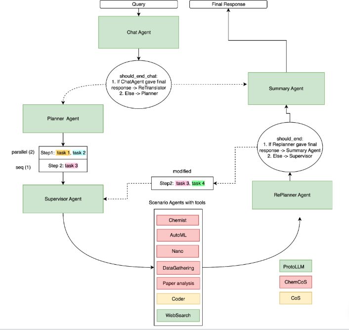

# CoScientist

---

[](https://badge.fury.io/py/coscientist)
[](https://pepy.tech/project/coscientist)
[](https://github.com/aimclub/OSA)

Built with:


---

## Overview

Enabling scientists to streamline research, CoScientist fuses artificial intelligence and chemistry tools into a modular agent architecture that handles every step from data retrieval to molecule design. Central to the system are specialized agents—chemist, nanoparticle, dataset builder, machine learning, coding, and paper analysis—each empowered by domain libraries such as RDKit, PubChem, BindingDB, and ChEMBL, and guided by a large‑language‑model assistant. Users can automate dataset assembly, clean and preprocess data, train generative models, generate compounds, predict properties, run calculations, and extract insights from publications, all through a single command‑line interface. The platform demonstrates how a multi‑agent framework can translate theoretical scientific reasoning into a reproducible, end‑to‑end workflow, accelerating discovery and democratizing access to complex computational methods.

---

## Table of Contents

- [Content](#content)
- [Algorithms](#algorithms)
- [Installation](#installation)
- [Getting Started](#getting-started)
- [Citation](#citation)

---
## Content

The repository implements a modular, agent‑driven framework that automates chemistry research workflows. A configuration layer loads settings and environmental variables, which feed a graph planner that builds a directed execution plan. Domain agents—chemist, nanoparticle, dataset builder, machine‑learning, coding, and paper‑analysis—each wrap specialized tools such as RDKit, PubChem, BindingDB, and ChEMBL, or LLM‑based instructions. They perform tasks including data retrieval, preprocessing, AutoML/DL training, generative molecule creation, property prediction, computational chemistry calculations, and literature extraction. The CLI triggers the graph, while agents exchange finely tracked reasoning steps and metadata. Docker and Poetry guarantee reproducibility, and comprehensive tests validate agent interactions. Together, these components provide a cohesive, end‑to‑end platform that reduces manual coding and accelerates chemoinformatics discovery.

---

## Algorithms

The system orchestrates a fully automated chemical discovery pipeline that marries data acquisition, preprocessing, machine‑learning, and large‑language‑model reasoning. 1) Data residues from public resources (ChemBL, BindingDB) are fetched, cleaned, and enriched with RDKit descriptors (QED, logP, etc.) to produce standardized training sets. 2) An AutoML/DNN training routine builds predictive models for property regression or classification, and a generative neural network learns SMILES distributions, enabling de novo molecule generation. 3) A vision‑enabled LLM agent parses scientific papers and images, extracting facts and tables. 4) A reactive LLM planner coordinates these tasks, falls back to web search, and manages parallel execution and state checkpointing, achieving end‑to‑end discovery from query to actionable chemical insights.

---

## Installation

**Prerequisites:** requires Python &gt;=3.11,&lt;3.12

Install CoScientist using one of the following methods:

**Using PyPi:**

```sh
pip install coscientist
```

**Using Poetry:**

```bash
poetry install

# Install ProtoLLM without its dependencies
echo "Installing ProtoLLM (no deps)"
poetry run pip install --no-deps git+https://github.com/aimclub/ProtoLLM.git@main
```

## Getting Started

Quick start
-----------
Once the environment is set up, you can start interacting with the ChemCoScientist system using the example queries below. Each query is a Python string that you pass to the AI interface.

**Basic inquiry**
```python
"What can you do?"
```

**Prepare dataset from ChEMBL**
```python
"Download data from ChemBL on the MEK1 protein with IC_50 calculations. Be sure to prepare them for training - remove junk data"
```

**Prepare dataset from a local file**
```python
"Prepare data for training from the file ./data_dir_for_coder/ChEMBL_data.xlsx - delete all values where docking_score > -6."
```

**Run a generative model**
```python
"Run training of the generative model on data from ./data_dir_for_coder/processed_MEK1_IC50_data.xlsx, specify the IC50 target, name the case MEK1."
```

**Check training status**
```python
"Check the status of the training for the MEK1 case"
```

**Start inference**
```python
"Start generating molecules for the MEK1 case."
```

**Predict properties**
```python
"Predict the properties of COc1ccc(-c2cc3ncn(C)c(=O)c3c(NC3CC3)n2)cc1OC using the MEK1 ml model."
```

**Discover available models**
```python
"Find out for which cases there are generative models ready for inference?"
```

System diagram
---------------


---

## Citation

If you use this software, please cite it as below.

### APA format:

    ITMO-NSS-team (2025). CoScientist repository [Computer software]. https://github.com/ITMO-NSS-team/CoScientist

### BibTeX format:

    @misc{CoScientist,

        author = {ITMO-NSS-team},

        title = {CoScientist repository},

        year = {2025},

        publisher = {github.com},

        journal = {github.com repository},

        howpublished = {\url{https://github.com/ITMO-NSS-team/CoScientist.git}},

        url = {https://github.com/ITMO-NSS-team/CoScientist.git}

    }

---
