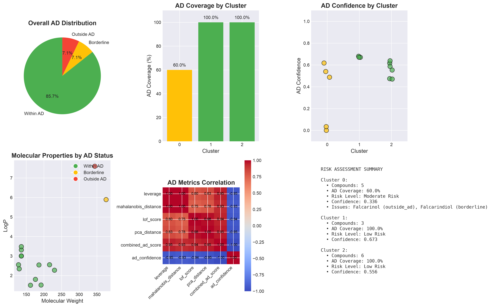
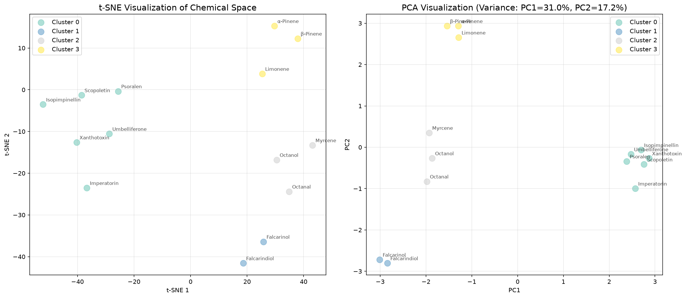
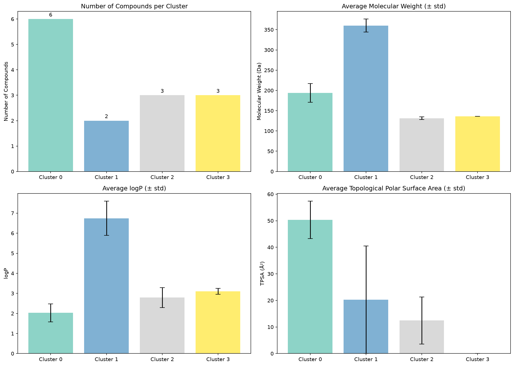
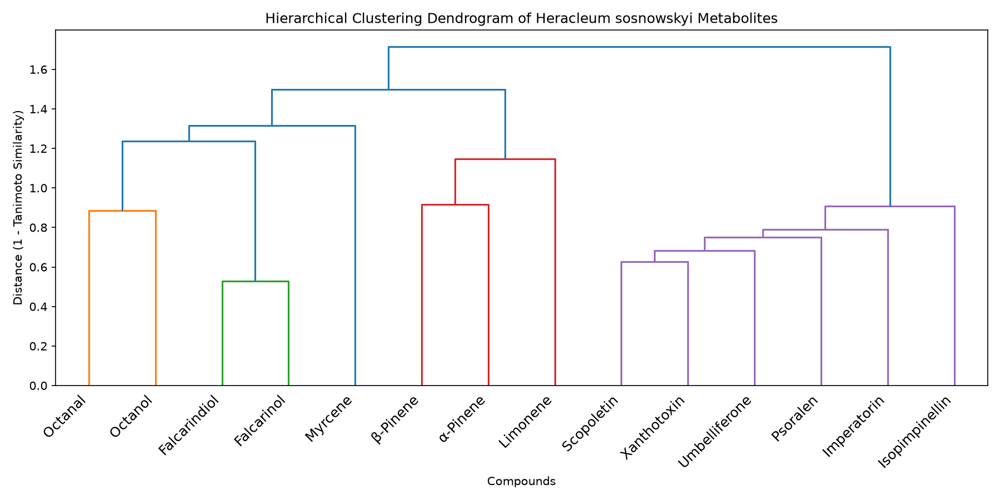
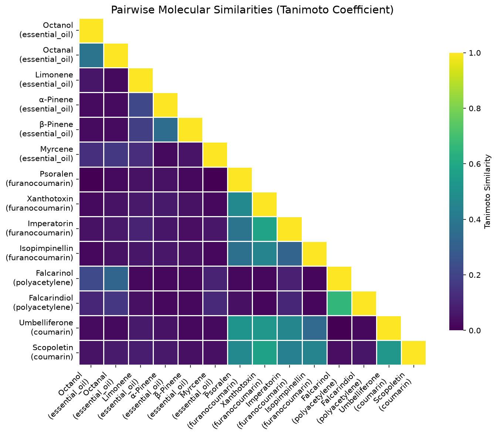

# Heracleum sosnowskyi Toxicity Profile Assessment Report

## Experiment Overview

This report summarizes the findings from the Heracleum sosnowskyi toxicity profile assessment, focusing on the potential pharmaceutical value of its metabolites and their safety profiles, amidst the need for research on this invasive species.

### Objectives and Outcomes
- **Research Question**: Can the invasive plant, potentially undergoing large-scale eradication, provide pharmaceutical value through its metabolites, and which of these are safe for consideration?
- **Key Findings**: The assessment yielded several critical insights into the metabolites of Heracleum sosnowskyi, their toxicity risks, and possible therapeutic applications.

### Artifacts Generated
1. **Literature Review**:
   - Artifact: `literature_review.md`
2. **Compounds Dataset**:
   - Artifact: `compounds.json` - Overview of 14 unique compounds with experimental validation.
3. **Clustering Analysis**:
   - Artifact: `clusters.json` - Insights into molecular similarities among metabolites.
4. **Toxicity Predictions**:
   - Artifact: `toxicity_profiles.json` - LD50 predictions and toxicity classifications.
5. **Applicability Domain Analysis**:
   - Artifact: `ad_analysis.json` - Evaluation of the reliability of the toxicity predictions.
6. **Specific Toxicity Profiling**:
   - Artifact: `specific_toxicity_report.md` - Analysis of specific toxicity endpoints.

### Key Figures and Tables
Below are visual representations and a data table generated during the experiment:

## Figures

### Applicability Domain Visualization

### Chemical Space Analysis

### Cluster Properties

### Dendrogram of Clusters

### Similarity Heatmap

## Data Tables

### Research Papers Summary — [Download](tables/search_papers_109_4_str42.pdf)
| %PDF-1.3 |
| --- |
| % |
| 1983 0 obj <</Linearized 1/L 620304/O 1987/E 237328/N 6/T 580595/H [ 1136 640]>> |
| endobj |
| xref |
| 1983 42 |
| 0000000016 00000 n |
| 0000001776 00000 n |
| 0000001136 00000 n |
| 0000001978 00000 n |
| 0000002015 00000 n |
| 0000002482 00000 n |
| 0000002549 00000 n |
| 0000003021 00000 n |
| 0000003049 00000 n |

*… showing first 15 of 8861 rows.*

### Next Steps
- Initiate verification methods for hypotheses regarding the extent of compounds studied (H4) and the statistical power for modeling (H5).
- Continue to evaluate the ecological and pharmaceutical potential of Heracleum sosnowskyi metabolites for informed decision-making in future applications.

This comprehensive assessment acknowledges both the risks associated with these metabolites and their potential value, guiding future research and regulatory efforts.