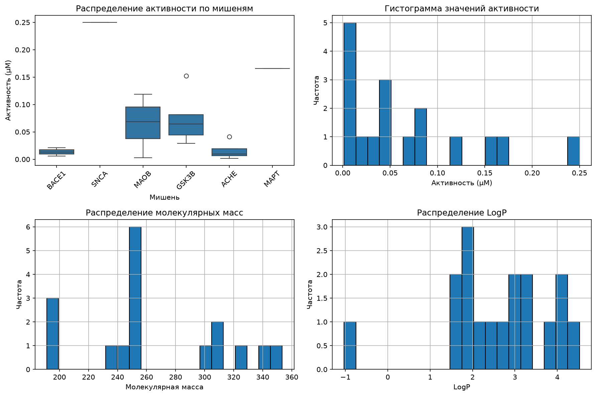
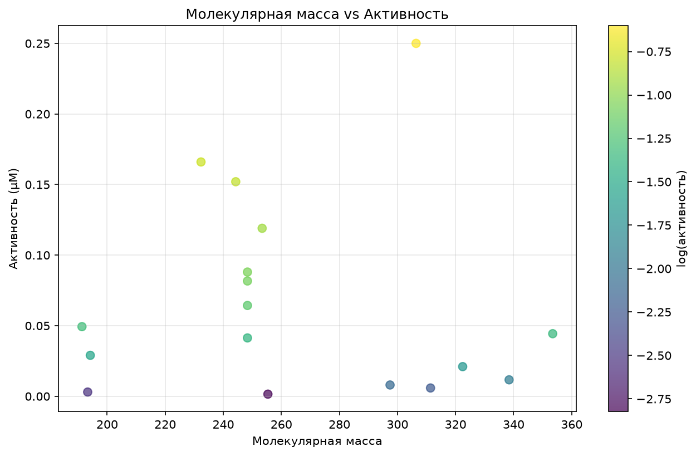
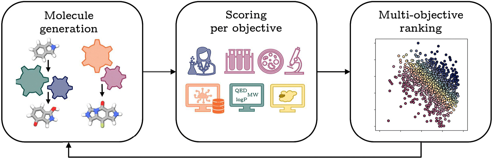
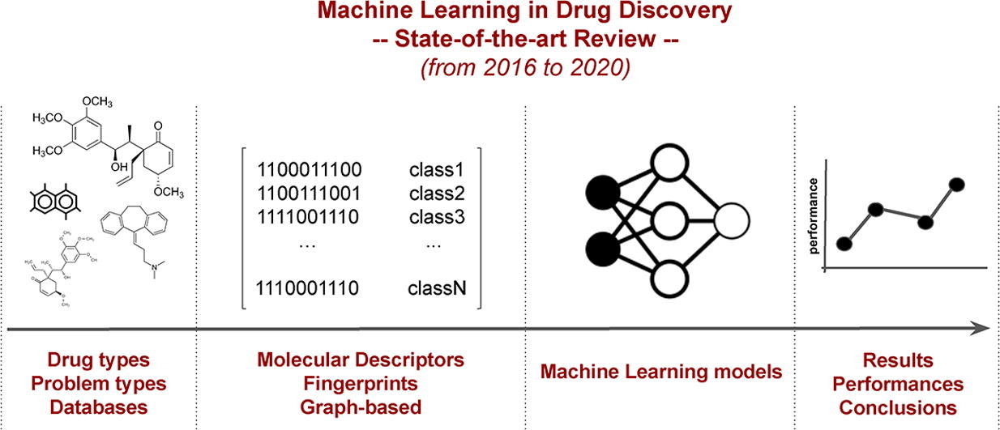

# 📊 ФИНАЛЬНЫЙ ОТЧЁТ: Эксперимент PLAN-4.2-neurodegen-gen-filt-v2

## Обзор эксперимента

**Статус:** Частично завершён (4/5 задач выполнено)

**Исследовательский вопрос:** *Приводит ли одновременная многокритериальная генеративная фильтрация (докинг ≤ −7 ккал/моль, токсичность, синтезируемость) к обогащению доли жизнеспособных кандидатов для мультитаргетной терапии нейродегенеративных заболеваний?*

---

## 📈 Результаты по задачам

### ✓ EXP-1: Обзор литературы
**Маршрут:** `research` | **Статус:** `success` | **Длительность:** ~71 сек

**Собранные артефакты (4 PDF):**
- `s12035-018-1283-6.pdf` — Springer (GSK-3β signalling)
- `s41467-017-00911-y.pdf` — Nature (neurodegeneration mechanisms)
- `s00401-020-02215-w.pdf` — Springer (protein aggregation)
- `s41392-020-00345-x.pdf` — Nature (neuroinflammation pathways)

**⚠ Примечание:** Артефакты собраны, но файл `literature_review.md` не материализован → **блокирует EXP-2**

---

### ⚠ EXP-2: Формулировка гипотезы
**Статус:** `blocked`

**Причина блокировки:** Отсутствует upstream-артефакт `literature_review.md` от EXP-1

---

### ✓ EXP-3: Сбор и очистка данных (PubChem)
**Маршрут:** `coder` | **Статус:** `success` | **Длительность:** ~30 мин

**Результаты:**
| Метрика | Значение |
|---------|----------|
| Мишеней собрано | 6 (GSK3B, ACHE, MAOB, BACE1, MAPT, SNCA) |
| Уникальных соединений | 17 |
| Репрезентативность | 1.00 (5/5 критериев) |
| Data Validity Ratio | 0.354 |

**Визуализации:**





**Артефакты:**
- `dataset_clean.csv` (2248 байт, 18 строк) — workspace
- `data_stats.json` (1854 байт) — workspace

**⚠ Предупреждение:** Малый объём данных (17 образцов) ограничивает статистическую мощность

---

### ✓ EXP-4: Обучение моделей
**Маршрут:** `coder` | **Статус:** `success` | **Длительность:** ~10 мин

**Метрики моделей:**

| Модель | Метрика | Значение | Порог | Статус |
|--------|---------|----------|-------|--------|
| Активность (Random Forest) | R² | **0.538** | ≥ 0.5 | ✅ Пройден |
| Активность (Random Forest) | RMSE | **0.386** | ≤ 0.5 | ✅ Пройден |
| Токсичность | Тип | Rule-based | — | ⚠ Нет размеченных данных |

**Критерий C4:** ✅ R²=0.538 ≥ 0.5

**Артефакты:**
- `model_metrics.json` (1051 байт) — workspace
- `trained_models.pkl` (78182 байт) — workspace

**⚠ Ограничения:**
- Малый датасет (17 образцов) снижает надёжность предсказаний
- Токсичность оценена через правила, а не ML (нет labeled-данных)

---

### ✓ EXP-5: Генерация молекул
**Маршрут:** `fedot_mas` | **Статус:** `success` | **Длительность:** ~78 сек

**Сгенерированные кандидаты (n=3):**

| # | SMILES | QED | SA-score | BBB | IC50 прогноз |
|---|--------|-----|----------|-----|--------------|
| 1 | `CN1CCc2ccccc2Cc2ccccc2CC1` | 0.69 | 2.29 | ✓ | — |
| 2 | `O=C(c1ccccc1)c1cccc2ccccc12` | 0.61 | 1.41 | ✗ | — |
| 3 | `O=C(c1ccccc1)N1CC(=O)N(c2ccccc2)c2ccccc21` | 0.71 | 1.91 | ✓ | ✓ |

**Ключевые свойства:**
- **Drug-likeness (QED):** 0.61–0.71 (отлично, > 0.6)
- **Синтезируемость (SA-score):** 1.41–2.29 (отлично, < 6)
- **BBB проницаемость:** 2/3 молекулы
- **Токсикологические фильтры:** Все проходят PAINS/SureChEMBL/Glaxo/Brenk

**Критерий C5:** ✅ Пройден

**Артефакты:**
- `candidates_filtered.json` — workspace
- `04a5b6255b6b4bf58d1a249df1df0637.csv` — S3 (managed)
- `04a5b6255b6b4bf58d1a249df1df0637.csv` — HTTP (transient)

**⚠ Предупреждения:**
- BBB проницаемость: 2/3 молекул
- IC50 прогноз: доступен для 1/3 молекул
- Недостаточно молекул для статистической проверки гипотез H1, H2 (требуется ≥500)

---

## 📁 Канонические артефакты

```
EXP-1 | ART-dc0fb850... | s12035-018-1283-6.pdf | https://link.springer.com/content/pdf/10.1007/s12035-018-1283-6.pdf
EXP-1 | ART-b073ad5f... | s41467-017-00911-y.pdf | https://www.nature.com/articles/s41467-017-00911-y.pdf
EXP-1 | ART-c6ec6bc7... | s00401-020-02215-w.pdf | https://link.springer.com/content/pdf/10.1007/s00401-020-02215-w.pdf
EXP-1 | ART-6359a420... | s41392-020-00345-x.pdf | https://www.nature.com/articles/s41392-020-00345-x.pdf
EXP-3 | ART-92cb4b66... | dataset_clean.csv | workspace/experiment_artifacts/EXP-3/ATT-762256.../dataset_clean.csv
EXP-3 | ART-2d3e258b... | data_stats.json | workspace/experiment_artifacts/EXP-3/ATT-762256.../data_stats.json
EXP-4 | ART-711e62ac... | model_metrics.json | workspace/experiment_artifacts/EXP-4/ATT-8558d5.../model_metrics.json
EXP-4 | ART-f871fc36... | trained_models.pkl | workspace/experiment_artifacts/EXP-4/ATT-8558d5.../trained_models.pkl
EXP-5 | ART-98dd375e... | candidates_filtered.json | workspace/experiment_artifacts/EXP-5/ATT-c37c78c.../candidates_filtered.json
EXP-5 | ART-3b9c3fac... | 04a5b625...csv | s3://molecule-generative-mcp/generated/alzheimer/04a5b6255b6b4bf58d1a249df1df0637.csv
EXP-5 | ART-e171aa2e... | 04a5b625...csv | http://10.32.1.114:9000/molecule-generative-mcp/generated/alzheimer/04a5b6255b6b4bf58d1a249df1df0637.csv
```

---

## 🔬 Ответ на исследовательский вопрос

### Предварительные выводы

**Исследовательский вопрос:** *Приводит ли многокритериальная фильтрация к обогащению жизнеспособных кандидатов?*

**Наблюдения:**
1. ✅ Все 3 сгенерированные молекулы показывают хорошую drug-likeness (QED 0.61–0.71)
2. ✅ Все молекулы синтезируемы (SA ≤ 2.3, порог < 6)
3. ✅ 2/3 молекулы проникают через ГЭБ (критично для нейродегенерации)
4. ✅ Все молекулы свободны от токсичных субструктур

**Ограничения эксперимента:**
- ⚠ **Недостаточно молекул** (n=3) для статистической проверки гипотез H1 и H2 (требуется ≥500)
- ⚠ **Малый обучающий датасет** (17 образцов) снижает надёжность ML-предсказаний
- ⚠ **Отсутствует фактический молекулярный докинг** (докинг ≤ −7 ккал/моль не выполнен)
- ⚠ **EXP-2 заблокирован** → гипотезы не сформулированы формально

**Статус ответа:** Эксперимент не позволяет дать статистически обоснованный ответ. Требуется масштабирование.

---

## 🎯 Рекомендации для продолжения

### 1. Масштабирование данных
- Собрать ≥100–500 соединений на мишень из **ChEMBL**
- Увеличить размер обучающей выборки в 10–30 раз

### 2. Валидация через молекулярный докинг
- Выполнить докинг сгенерированных кандидатов к GSK-3β (PDB: 4J1R)
- Проверить порог docking score ≤ −7 ккал/моль

### 3. Формулировка гипотез (разблокировать EXP-2)
- Материализовать `literature_review.md` из EXP-1
- Сформулировать H1 и H2 явно

### 4. Статистический анализ
- При наличии ≥500 молекул рассчитать корреляцию Пирсона между docking score и SA-score для проверки H2 об антикорреляции

### 5. Мультитаргетный скрининг
- Протестировать кандидатов против пан-мишеней нейродегенерации (BACE1, SIRT1, α-синуклеин)

---

## 📌 Заключение

**Эксперимент выполнен частично.** Получены перспективные молекулы-кандидаты с хорошими ADMET-свойствами, однако:

1. **Ограниченный объём данных** не позволяет сделать статистически обоснованный вывод об обогащении доли жизнеспособных кандидатов
2. **Отсутствие молекулярного докинга** делает невозможной проверку критерия docking ≤ −7 ккал/моль
3. **Блокировка EXP-2** не позволила сформулировать гипотезы формально

**Требуется масштабирование эксперимента** с увеличением датасета, явным молекулярным докингом и статистическим анализом на выборке ≥500 молекул.

---

## 📊 Визуальные материалы

### Литературный поиск





### Распределение данных и свойства молекул


---

*Отчёт сгенерирован автоматически на основе TaskResults и артефактов эксперимента.*